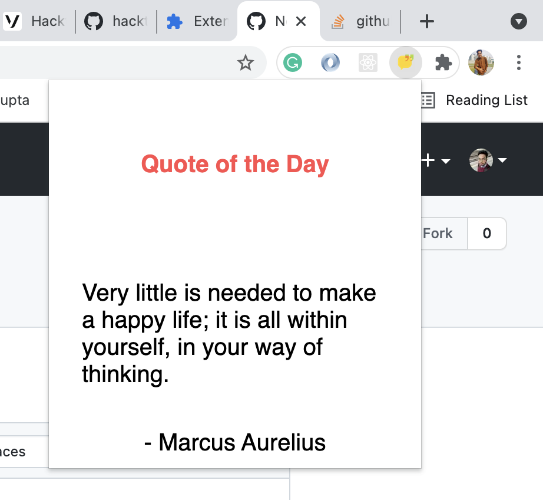
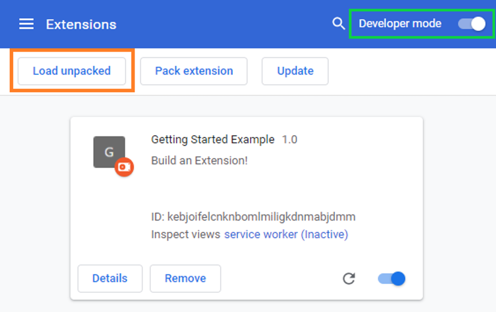

<p align="center">
  
</p>


<p align="center"> Quote of the day Chrome Extension</p>



## Features

- **Random Thought** - This extension uses a free api to get random thought and renders it on the current Tab.
- **Technologies Used** - HTML, Javascript and CSS

## About

This extension gives you a random thought of the day.

## Demo Development

Clone and install.

```bash
git clone git@github.com:ankit-95/Quote_chrome_extension.git
cd quote_extension
```

Run application.

You need to follow below steps to run this extension: 

- Open the Extension Management page by navigating to chrome://extensions.
- Alternatively, open this page by clicking on the Extensions menu button and selecting Manage Extensions at the bottom of the menu.
- Alternatively, open this page by clicking on the Chrome menu, hovering over More Tools then selecting Extensions
 - Enable Developer Mode by clicking the toggle switch next to Developer mode.
- Click the Load unpacked button and select the extension directory (i.e quote_extension where your code is cloned)



- Ta-da! The extension has been successfully installed.  
   icon were included in the manifest, this icon will be created for the extension.

## Acknowledgements

- A big thank you to [Google Chrome Docs
](https://github.com/search?q=chrome) for guiding me.

## Author

- [Ankit Gupta](https://ankit-95.github.io)

